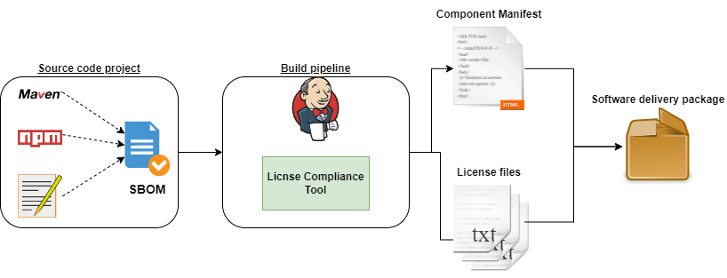

# COmponent ManIfest Creator (CoMiC)
## Purpose
Create a manifest of software components used in the software project, including their licenses and links to their source code.
The main purpose is to satisfy attribution and source code redistribution requirements by open-source licenses.

## Architecture

1. Create a [Software Bill of Materials](#Software Bill of Materials) (SBOM) for your source code.
2. Call the [Jenkins Plugin](#Jenkins Plugin) in your build job to create a component manifest.
You can [configure](#Global configuration) several JSON data sources to improve data quality.  
4. Add the component manifest (PDF or HTML) to your delivery package.

## Software Bill of Materials
The main input is [Software Bill of Materials](https://cyclonedx.org/capabilities/sbom/) (**SBOM**) of the software project.
It must be in the [CycloneDX](https://cyclonedx.org/) format.
It can be created manually, but if you are using a dependency management system, it is more efficient to create it from that information.
The CycloneDX toolchain supports several dependency management systems, e.g. [Apache Maven](https://github.com/CycloneDX/cyclonedx-maven-plugin)
or [NPM](https://github.com/CycloneDX/cyclonedx-node-npm). Take a look at their [GitHub page](https://github.com/CycloneDX) for a complete list.

## Jenkins Plugin
### Global configuration

### Create manifest
**Prerequisite**: A [Software Bill of Materials](https://cyclonedx.org/capabilities/sbom/) (**SBOM**) of your software project.
